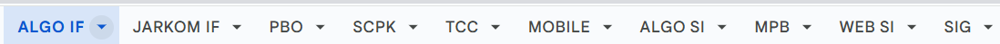
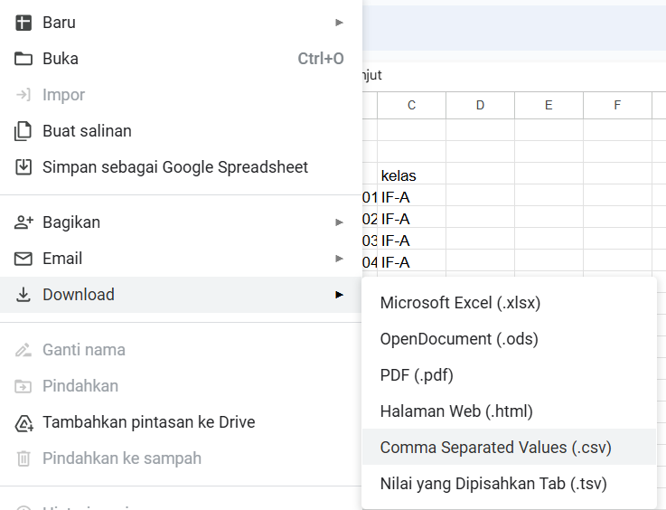
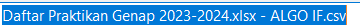
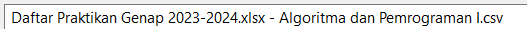
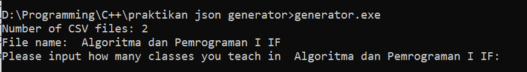
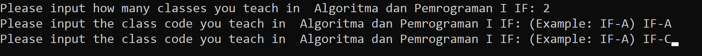
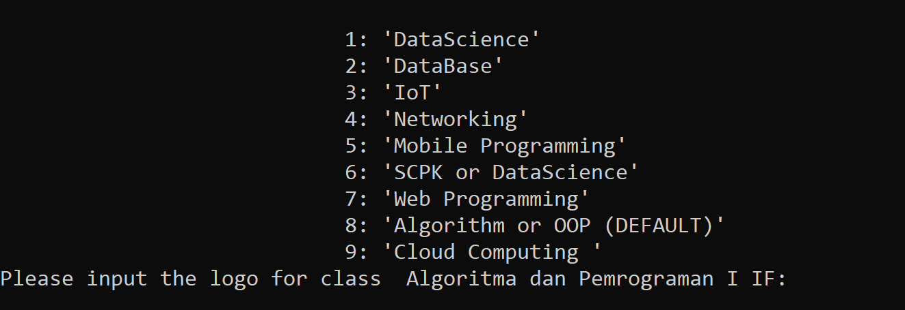
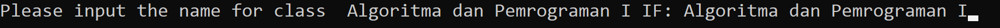
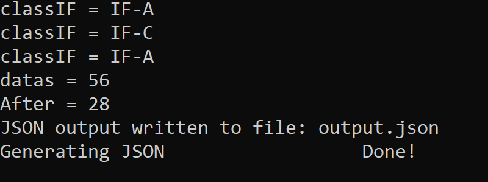
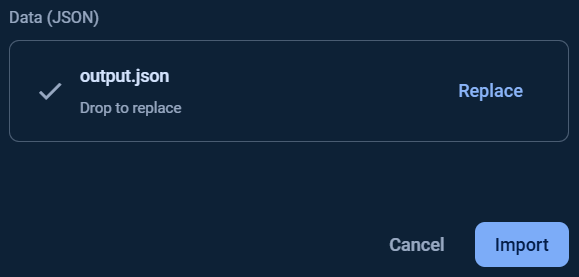

# Praktikan JSON Generator

This project is a C++ command-line application designed to generate JSON data for use with the LabLog application. The program reads data from CSV files and includes a loading animation to indicate the progress of the JSON generation process.

## Features

- Reads multiple CSV files from the current directory.
- Allows user input for class details and logo selection.
- Generates a JSON file with the processed data.

## Requirements

- C++11 or later
- Standard C++ libraries

## Usage

1. **Clone the repository:**

     ```sh
    git clone https://github.com/yourusername/praktikan-json-generator.git

    cd praktikan-json-generator
    ```

2. **Compile the code**

    Compile the source code (generator.cpp) into an executable file:
    ```sh 
    g++ -std=c++11 -o generator generator.cpp
    ```


3. **Download Your Class CSV**
    - Select your class
    
    
    - Export it in CSV format
    

    - (Optional) Rename the file according to your department.

        Before:
    
        After:

4. **Run the executable file**
    ```sh
    generator.exe
    ```
5. **Input data**

    - The program will display all detected CSV files. Ensure the files are in the same directory.
    

    - Specify how many classes you are teaching in each file.
    

    - Choose a logo for each class. This will be visible to students. The default logo code is 0.
    

    - Enter the name of the class as it will appear to students. For example, you can input "Dasar-Dasar Pemrograman" for Systems Information students or "Algoritma dan Pemrograman I" for Informatics students.

    - Verify the output.json file and upload it to Firebase.
6. **Upload to Firebase**
    
    Go to [LabLog Firebase](console.firebase.google.com/u/0/project/lablog-d9430/database/lablog-d9430-default-rtdb/data/~2Fusers).

    Click the more options icon and select "Import JSON." 

    Browse for the output.json file and click "Import." 


## Access

To gain access to the system or Firebase, please contact [Me](www.instagram.com/r_kavarera).


## Future update

Future updates will include the option to add Final Project data.

### Contribute

Contributions are welcome! Please fork the repository and submit a pull request with your changes.
